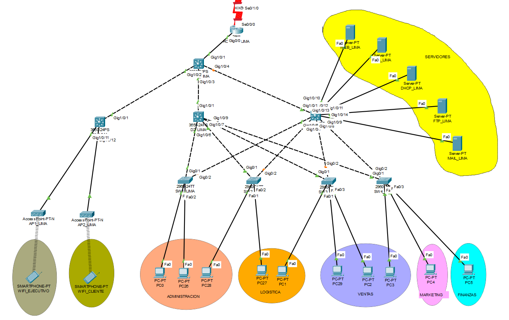

### Topología Física y Lógica de la red (Lima)

##### Nombre: Sede Principal - Lima
##### Dirección IP: 172.21.40.0/22

| Unidad Organizacional | Nombre de la VLAN | VLAN ID (VID) | Requisitos para host actuales | Requisitos para host actuales (20%) | Longitud de prefijo (LP) |
|-----------------------|-------------------|---------------:|-------------------------------:|------------------------------------:|-------------------------:|
| Ventas                | VENTAS            |             10 |                            198 |                              237.6 | /24                      |
| Administracion        | ADMINISTRACION    |             20 |                            100 |                              120.0 | /25                      |
| Finanzas              | FINANZAS          |             30 |                             41 |                               49.2 | /26                      |
| Wifi-Ejecutivos       | WIFI-EJECUTIVO    |             40 |                             31 |                               37.2 | /26                      |
| Marketing             | MARKETING         |             50 |                             29 |                               34.8 | /27                      |
| Logistica             | LOGISTICA         |             60 |                             25 |                               30.0 | /27                      |
| Nativa                | NATIVA            |             70 |                             20 |                               24.0 | /27                      |
| Wifi-Clientes         | WIFI-CLIENTE      |             80 |                             18 |                               21.6 | /27                      |
| Servidores            | SERVIDORES        |             90 |                             10 |                               12.0 | /28                      |
| **Total**             |                   |                |                            472 |                              566.4 |                          |

| Mascara Sub red      | Direccion de red    | Primer host       | Ultimo Host       | Direccion broadcast |
|----------------------|---------------------|-------------------|-------------------:|--------------------:|
| 255.255.255.0        | 172.21.40.0         | 172.21.40.1       | 172.21.40.254     | 172.21.40.255       |
| 255.255.255.128      | 172.21.41.0         | 172.21.41.1       | 172.21.41.126     | 172.21.41.127       |
| 255.255.255.192      | 172.21.41.128       | 172.21.41.129     | 172.21.41.190     | 172.21.41.191       |
| 255.255.255.192      | 172.21.41.192       | 172.21.41.193     | 172.21.41.254     | 172.21.41.255       |
| 255.255.255.224      | 172.21.42.0         | 172.21.42.1       | 172.21.42.30      | 172.21.42.31        |
| 255.255.255.224      | 172.21.42.32        | 172.21.42.33      | 172.21.42.62      | 172.21.42.63        |
| 255.255.255.224      | 172.21.42.64        | 172.21.42.65      | 172.21.42.94      | 172.21.42.95        |
| 255.255.255.224      | 172.21.42.96        | 172.21.42.97      | 172.21.42.126     | 172.21.42.127       |
| 255.255.255.240      | 172.21.42.128       | 172.21.42.129     | 172.21.42.142     | 172.21.42.143       |

