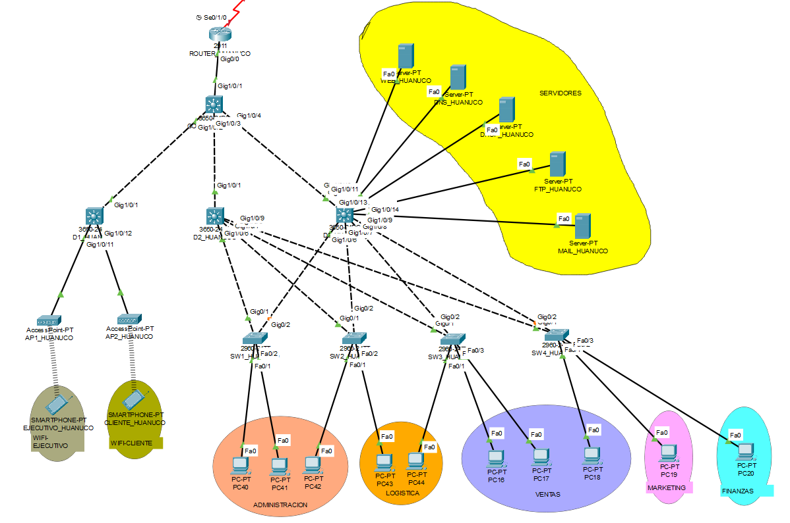

### Topología Física y Lógica de la red (Huanuco)

##### Nombre: Sucursal 3 - Huanuco
##### Dirección IP: 172.21.52.0/22

| Unidad Organizacional | Nombre de la VLAN | VLAN ID (VID) | Requisitos para host actuales | Requisitos para host actuales (20%) | Longitud de prefijo (LP) |
|-----------------------|-------------------|---------------:|-------------------------------:|------------------------------------:|-------------------------:|
| Ventas                | VENTAS            |             10 |                             50 |                               60.0 | /26                      |
| Administracion        | ADMINISTRACION    |             20 |                             25 |                               30.0 | /27                      |
| Finanzas              | FINANZAS          |             30 |                             10 |                               12.0 | /28                      |
| Wifi-Ejecutivos       | WIFI-EJECUTIVO    |             40 |                              8 |                                9.6 | /28                      |
| Marketing             | MARKETING         |             50 |                              7 |                                8.4 | /28                      |
| Logistica             | LOGISTICA         |             60 |                              6 |                                7.2 | /29                      |
| Nativa                | NATIVA            |             70 |                              6 |                                7.2 | /29                      |
| Wifi-Clientes         | WIFI-CLIENTE      |             80 |                              5 |                                6.0 | /29                      |
| Servidores            | SERVIDORES        |             90 |                              3 |                                3.6 | /29                      |
| **Total**             |                   |                |                            120 |                              144.0 |                          |

| Mascara Sub red      | Direccion de red    | Primer host       | Ultimo Host       | Direccion broadcast |
|----------------------|---------------------|-------------------|-------------------:|--------------------:|
| 255.255.255.192      | 172.21.52.0         | 172.21.52.1       | 172.21.52.62      | 172.21.52.63       |
| 255.255.255.224      | 172.21.52.64        | 172.21.52.65      | 172.21.52.94      | 172.21.52.95       |
| 255.255.255.240      | 172.21.52.96        | 172.21.52.97      | 172.21.52.110     | 172.21.52.111      |
| 255.255.255.240      | 172.21.52.112       | 172.21.52.113     | 172.21.52.126     | 172.21.52.127      |
| 255.255.255.240      | 172.21.52.128       | 172.21.52.129     | 172.21.52.142     | 172.21.52.143      |
| 255.255.255.248      | 172.21.52.144       | 172.21.52.145     | 172.21.52.150     | 172.21.52.151      |
| 255.255.255.248      | 172.21.52.152       | 172.21.52.153     | 172.21.52.158     | 172.21.52.159      |
| 255.255.255.248      | 172.21.52.160       | 172.21.52.161     | 172.21.52.166     | 172.21.52.167      |
| 255.255.255.248      | 172.21.52.168       | 172.21.52.169     | 172.21.52.174     | 172.21.52.175      |

