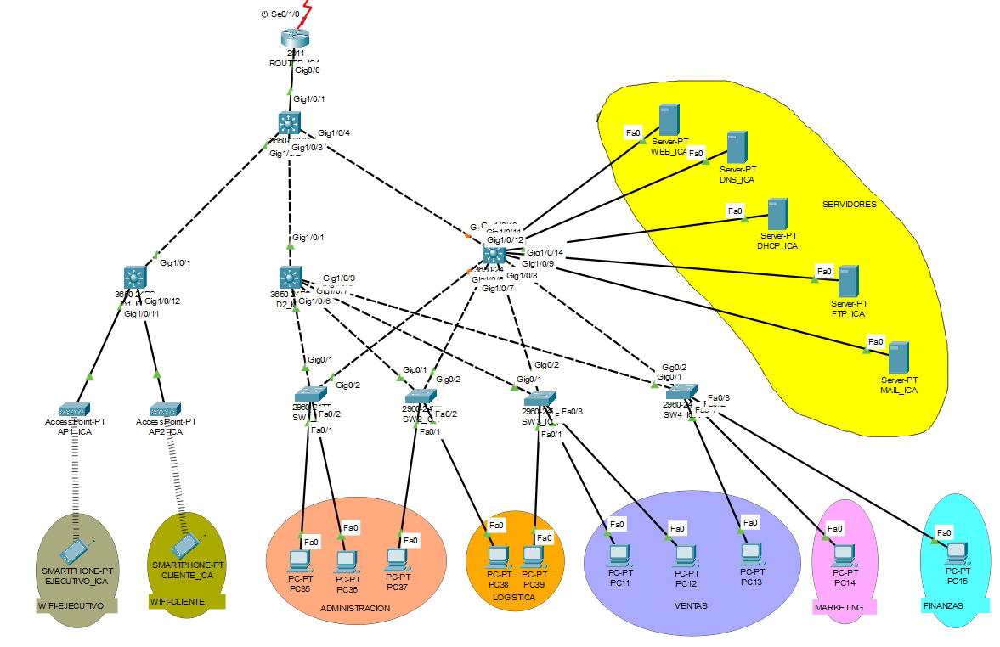

### Topología Física y Lógica de la red (Ica)

##### Nombre: Sucursal 2 - Ica
##### Dirección IP: 172.21.48.0/22

| Unidad Organizacional | Nombre de la VLAN | VLAN ID (VID) | Requisitos para host actuales | Requisitos para host actuales (20%) | Longitud de prefijo (LP) |
|-----------------------|-------------------|---------------:|-------------------------------:|------------------------------------:|-------------------------:|
| Ventas                | VENTAS            |             10 |                             54 |                               64.8 | /26                      |
| Administracion        | ADMINISTRACION    |             20 |                             27 |                               32.4 | /27                      |
| Finanzas              | FINANZAS          |             30 |                             11 |                               13.2 | /28                      |
| Wifi-Ejecutivos       | WIFI-EJECUTIVO    |             40 |                              9 |                               10.8 | /28                      |
| Marketing             | MARKETING         |             50 |                              8 |                                9.6 | /28                      |
| Logistica             | LOGISTICA         |             60 |                              7 |                                8.4 | /28                      |
| Nativa                | NATIVA            |             70 |                              6 |                                7.2 | /29                      |
| Wifi-Clientes         | WIFI-CLIENTE      |             80 |                              5 |                                6.0 | /29                      |
| Servidores            | SERVIDORES        |             90 |                              3 |                                3.6 | /29                      |
| **Total**             |                   |                |                            130 |                              156.0 |                          |

| Mascara Sub red      | Direccion de red    | Primer host       | Ultimo Host       | Direccion broadcast |
|----------------------|---------------------|-------------------|-------------------:|--------------------:|
| 255.255.255.192      | 172.21.48.0         | 172.21.48.1       | 172.21.48.62      | 172.21.48.63       |
| 255.255.255.224      | 172.21.48.64        | 172.21.48.65      | 172.21.48.94      | 172.21.48.95       |
| 255.255.255.240      | 172.21.48.96        | 172.21.48.97      | 172.21.48.110     | 172.21.48.111      |
| 255.255.255.240      | 172.21.48.112       | 172.21.48.113     | 172.21.48.126     | 172.21.48.127      |
| 255.255.255.240      | 172.21.48.128       | 172.21.48.129     | 172.21.48.142     | 172.21.48.143      |
| 255.255.255.240      | 172.21.48.144       | 172.21.48.145     | 172.21.48.158     | 172.21.48.159      |
| 255.255.255.248      | 172.21.48.160       | 172.21.48.161     | 172.21.48.166     | 172.21.48.167      |
| 255.255.255.248      | 172.21.48.168       | 172.21.48.169     | 172.21.48.174     | 172.21.48.175      |
| 255.255.255.248      | 172.21.48.176       | 172.21.48.177     | 172.21.48.182     | 172.21.48.183      |
